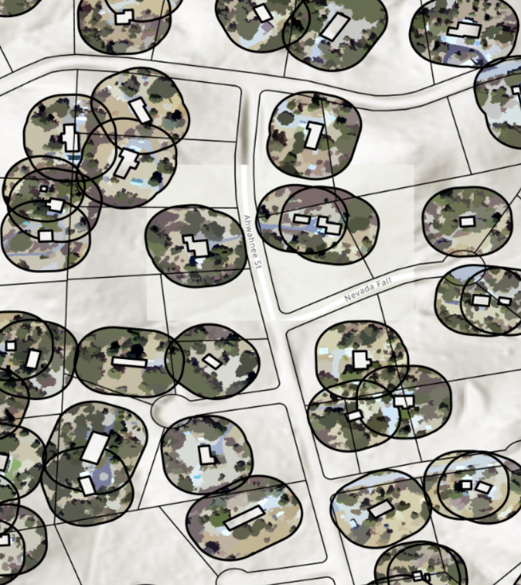

# The Hot Parcels

<a href="https://github.com/CU-ESIIL/social-impacts-of-transformations-innovation-summit-2025__14/edit/main/docs/index.md" title="Edit this page">✏️</a>

<!-- =========================================================
HERO (Swap hero.jpg, title, strapline, and the three links)
========================================================= -->

[Raw photo location: hero.jpg](https://github.com/CU-ESIIL/social-impacts-of-transformations-innovation-summit-2025__14/blob/main/docs/assets/image.png)

**One sentence on impact:** In 3 days, we explore how communities navigate transformative environmental change, producing actionable visuals, a concise brief, and shareable code for partners.

**[Project brief (PDF)](assets/Seven%20ways%20to%20measure%20fire%20polygon%20velocity-4.pdf) · [View shared code](https://github.com/CU-ESIIL/social-impacts-of-transformations-innovation-summit-2025__14/blob/main/code/fired_time_hull_panel.ipynb) · [Explore data](https://github.com/CU-ESIIL/social-impacts-of-transformations-innovation-summit-2025__14/blob/main/code/prism_quicklook.py)**

> **About this site:** This is a public, in-progress record of the Social Impacts of Transformations team at the 2025 Innovation Summit. Edit everything here in your browser: open a file → pencil icon → Commit changes.

---

## How to use this page (for the team)
- **Edit this file:** `docs/index.md` → ✎ → change text → **Commit changes**.
- **Add images:** upload to `docs/assets/` and reference like `assets/your_file.png`.
- Keep **text short** and **visuals first**. Think “slide captions,” not essays.

---

## Day 1 — Define & Explore
*Focus: questions, hypotheses, context; add at least one visual (photo of whiteboard/notes).*

### Our product 📣
- We would like to create a publication to support our grant and funding goals. As a future direction, we would like to create a public resource or tool to communicate fire resilience strategies.

### Our question(s) 📣
<!-- EDIT: Replace bullets with your own. Encourage divergent takes. -->
- What are we trying to understand or change? We would like to improve people's understanding of how to balance individual vs communal risk around wildfires. Collective assessment of risk. Mitigation post fire events. 
- Why now? Why here? Gap in understanding of the built environments impact on fire events and mitigation. Colorado and California has a large population in the woowee, wild urban interface. Population shift and people migration pre- and post-pandemic. Many different stakeholders, both public and private. Complimentary studies between defencible space and socioeconomic factors. This case study compliments existing work.
- Who benefits if we succeed? Our goal is to make the deliverable as a case study that helps the communities at risk. Use the information in this study to benefit the community that we are studying. Help the community make better decisions.

### Hypotheses / intentions [Optional: probably not relevant if you are creating an educational tool]
<!-- EDIT: Plain language, short and honest. -->
- We think that 
- We intend to test whether …
- We will know we’re onto something if …

### Why this matters (the “upshot”) 📣
<!-- EDIT: 2–3 sentences max, decision-oriented. -->
Explain who is impacted and how this could change decisions or understanding. The communities that are impacted are those in California and Colorado specifically those that have been affected by a fire events within the past 2 decades. How does individual risk relate to community risk and how is risk impacted by those within the community in relation to each other. Are/which socioeconomic factors correlated to any trends seen in individual vs communal risk mitagation.

### Inspirations (papers, datasets, tools)
<!-- EDIT: Swap in your own links. -->
- Publication: [Influential paper title](https://doi.org/xxxx)
- Dataset portal: [Example data hub](https://example.org)
- Tool/tech: [Method or library](https://example.org)

### Field notes / visuals
<!-- EDIT: Replace with a real smartphone photo or sketch; keep filename simple. -->

[Raw photo location: day1_whiteboard.jpg](https://github.com/CU-ESIIL/social-impacts-of-transformations-innovation-summit-2025__14/blob/main/docs/assets/day1_whiteboard.jpg)
*Caption: What this shows and why it’s useful today.*

> **Different perspectives:** Briefly capture disagreements or alternate framings. These can unlock innovation.

---

## Day 2 — Data & Methods
*Focus: what we’re testing and building; show a first visual (plot/map/screenshot/GIF).*

### Data sources we’re exploring 📣
<!-- EDIT: Link each source; add size/notes if relevant. --> All within Mariposa county and contiguous counties. All of Colorado State and Wyoming State, and contiguous?
1. Highest imagery NAIP 60; RGB and NDVI - either RGB or NDVI maybe use one, maybe use both.
2. Then use 4 classifications below.
3. Third is zoning maps.
4. Then corelogic resolution, years, construction types.
5. Census data or ACS, every 4 years data; 2024?, 2016, 2012, 2008, 2004, 2000; health data, social data, housing data, economic.
6. Roads, maybe OSM? Or local road/county road databases for spacial network analysis
7. 14,000 parcels, over many years, for each polygon was it within 6 miles of the fire.
8. Evacs, 209's, structures threatened in 24 hrs
Four classifications: man made, water, barren, and vegetation

The output will be an excel with one column as parcels, then connectivity, % defensible space or 100ft, how close fire 1, how close fire 2: and then do this for each year. On years where we have census data it will be added on there too.

Collaborate COI engine.

### Methods / technologies we’re testing 📣
- Approach 1: Image classification on the naips imagery, joining this to fast fires for county, joining to cencus data by tract.
- Approach 2 (e.g., random forest on features)
- Visualization (e.g., map tiles, small multiples)

### Challenges identified
- Data gaps / quality issues: map data resolution is not always ideal for the parcels we are working with. Census data is collected and published every 4 years vs fire data that is collected and published annually.
- Method limitations / compute constraints
- Open questions we need to decide on: Will be begin with analyzing defensible space surrounding the center of a parcel pre and post fire event and also layer on census data on top or will be do two seperate analyses one focusing on the pre-vs post-fire event defensible space rebuild and one focusing on the rebuilding of defensible space in difference socio-economic regions.

---

## Final Share Out — Insights & Sharing 
*Focus: synthesis; highlight 2–3 visuals that tell the story; keep text crisp. Practice a 2-minute walkthrough of the homepage 📣: Why → Questions → Data/Methods → Findings → Next.*

Independent variable: percent of parcel in compliance each year
Dependent variables: socioeconomic variables, connectivity, fire history (within a certain radius, like 1 mile or 2 miles), proximity to water bodies, proximity to fire stations, how much funding was made available to certain parcels and how much was utlized by those communities (NRCS and firewise), 

### Findings at a glance 📣
- 1 Location: Comparing Mariposa, California with Boulder, Colorado
- 2 Timeframe: Going back to 2005 and going until 2024 (once available)
- 3 Frequency: Looking at yearly or biyearly fire data and naip imagery and census data from every 4 years
- 4 Classifications: classifying imagery into landcover vs build structures vs vegetation fuel vs barren
- 5 Calculation: percent of parcel that is in compliance with defensible space requirements. Connectivity per parcel (via road networks? Point pattern metrics like number of neighbors?), we are still considering parameters for this.

### What’s next? 📣
- Set up follow up meetings and a timeline for publication (Rachel)
- Week 1: pull census data for Mariposa and Boulder (Beth and Lise), corelogic dataset (Lise)
- Week 1 - 2: remote sensing challenge tackling (Beth and Lise and Virginia), get NDVI data, talk to NRCS and FireWise (who got $?) (Beth)
- Week 3 - 4: quantification and calculation (Beth and Lise and Virginia) - percent of parcels in compliance, phone a network analysis person for connectivity analysis (anyone here who can help?)
- Week 5 - 6: Refine hypothesis based on data that has been collected, what can we actually test and what's the right modeling approach? Revisit: is the goal still a publication? If so, let Chelsea know about our intention to submit to the special issue.
- Week 6 and beyond: review timeline, check in, what's next

---

---

## Team
| Name | Role | Contact | GitHub |
|------|------|---------|--------|
| Jane Doe | Lead | jane.doe@example.org | @janedoe |
| John Smith | Analyst | john.smith@example.org | @jsmith |

---

## Storage

Code
Keep shared scripts, notebooks, and utilities in the [`code/`](https://github.com/CU-ESIIL/social-impacts-of-transformations-innovation-summit-2025__14/tree/main/code) directory. Document how to run them in a README or within the files so teammates and visitors can reproduce your workflow.

Documentation
Use the [`docs/`](https://github.com/CU-ESIIL/social-impacts-of-transformations-innovation-summit-2025__14/tree/main/docs) folder to publish project updates on this site. Longer internal notes can live in [`documentation/`](https://github.com/CU-ESIIL/social-impacts-of-transformations-innovation-summit-2025__14/tree/main/documentation); summarize key takeaways here so the public story stays current.

---

## Cite & reuse
If you use these materials, please cite:

> Lastname, A., Lastname, B. (2025). *Project title*. DOI or URL.

License: CC-BY-4.0 unless noted. See dataset licenses on the **[Data](data.md)** page.

---

<!-- EDIT HINTS
- Upload images to docs/assets/ and reference as assets/filename.png
- Keep images ~1200 px wide; avoid >5–8 MB per file.
- Use short, active sentences; this is a scrolling “slide deck.”
- Update this page at least once per day during the sprint.
-->
